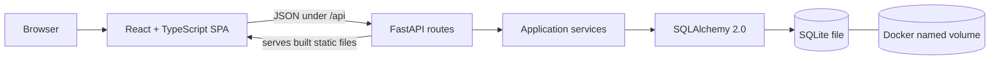
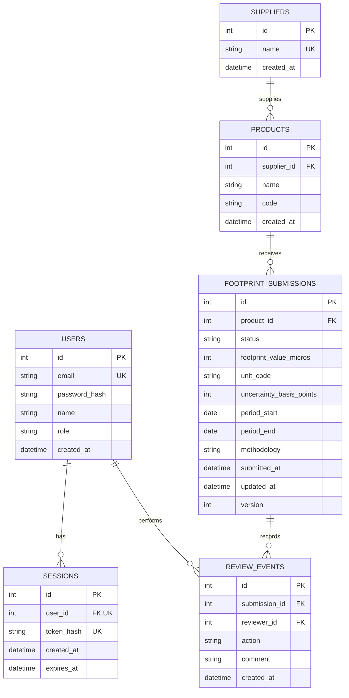

# Emissions Monitor

Emissions Monitor is a full-stack product-footprint review application. Reviewers can browse, create, edit, delete, search, filter, sort, inspect, approve, and reject fictional supplier submissions without losing their queue context.

The implementation intentionally favors explicit, understandable code that can be changed confidently during a follow-up pairing session.

## 1. System overview



- React owns presentation, URL state, local drafts, and frontend-calculated Duration.
- FastAPI owns authentication, authorization, validation, status transitions, concurrency, and safe API errors.
- SQLAlchemy owns parameterized persistence and transactions.
- Alembic owns schema history.
- SQLite stores the application data in a Docker named volume.
- In the final container, FastAPI serves both `/api/*` and the compiled React SPA from one origin.

## 5. Database ERD

The methodology lookup table has been removed. Methodology is stored directly as text on each footprint submission.



## Run with Docker

Requirements: Docker Desktop or Docker Engine with Compose.

```bash
docker compose up --build
```

Open [http://localhost:5173](http://localhost:5173). This starts development mode by default: frontend edits hot-update in the browser and backend edits automatically restart FastAPI.

Demo reviewer:

```text
Email: a@a.a
Password: 1234
```

Registration is also available. The database is stored in the Docker named volume `emissions_data`, so normal container restarts preserve users, sessions, submissions, and review history.

Stop the application without deleting data:

```bash
docker compose down
```

Reset all application data and return to the original 36 `new` fixtures:

```bash
docker compose down -v
docker compose up --build
```

Warning: `docker compose down -v` deliberately deletes the local named volume and cannot preserve its review history.

Follow both development logs:

```bash
docker compose logs -f app frontend
```

The containers use polling so file changes are detected reliably through Docker Desktop on macOS. Dependency-file changes (`package-lock.json` or `requirements.txt`) still require rebuilding with `--build`.

### Production-style container

To build the single production-style container without the automatic development override:

```bash
docker compose -f compose.yaml up --build
```

Open [http://localhost:8000](http://localhost:8000).

## Local development without Docker

The commands below use two terminals so Vite provides fast frontend refresh while proxying `/api` to FastAPI.

Backend:

```bash
python3 -m venv backend/.venv
source backend/.venv/bin/activate
python -m pip install -r backend/requirements.txt
cd backend
alembic upgrade head
python -m app.db.seed
fastapi dev app/main.py
```

Frontend:

```bash
cd frontend
npm install
npm run dev
```

Open [http://localhost:5173](http://localhost:5173). Local SQLite data lives under `backend/data/` and is ignored by Git.

## Verification

```bash
cd backend
python -m pytest
ruff check app alembic tests
ruff format --check app alembic tests
```

```bash
cd frontend
npm test
npm run lint
npm run build
```

FastAPI's local interactive documentation is available at [http://localhost:8000/docs](http://localhost:8000/docs).

## Completed scope

- Register, login, logout, current-user restoration, Argon2id password hashing, and hashed HTTP-only cookie sessions.
- 36 deterministic fictional footprint submissions and a documented demo reviewer.
- Paginated Table and equal-width Card views with responsive behavior.
- Search across product, SKU, and supplier; search-aware status counts; status filtering; allowlisted sorting; and 10/20/50/100 page sizes.
- URL-preserved search, filter, sort, page, view, and selected Detail state.
- Derived and sortable Last modified activity using the newest immutable review event, with submission time as the fallback and no extra database field.
- Shared local Display preferences for optional fields.
- Centered desktop Detail dialog and full-screen mobile Detail.
- Inline and Detail approval/rejection with optional comments and immutable latest-first history.
- Add, edit, and confirmed-delete submission workflows with system-managed status, history, timestamps, and versions.
- Loading, empty, filtered-empty, retryable error, validation, not-found, success, and concurrency-conflict states.
- Exact decimal values from SQLite through Python and JSON to TypeScript without floating-point conversion.
- Optimistic concurrency using `expected_version` and HTTP 409 with the latest Detail.
- At most one `opened` history event per submission, enforced by both transactional application logic and a SQLite unique partial index.
- Keyboard-friendly controls, visible focus, semantic labels, focus-managed dialogs, live notifications, and non-color high-emissions/high-uncertainty cues.
- Alembic migration, persistent Docker volume, health check, API integration test, timestamp regression tests, Python lint/format checks, and frontend lint/build checks.

## Architecture

```text
React + TypeScript SPA
        ↓ JSON / HTTP-only cookie
FastAPI routes
        ↓
Application services and transaction boundaries
        ↓
SQLAlchemy 2.0 + Alembic
        ↓
SQLite in a Docker named volume
```

FastAPI serves the compiled SPA and API from one origin in Docker. During local development, Vite proxies `/api` to FastAPI.

The frontend is organized by feature. The backend separates HTTP routes, Pydantic API schemas, use-case services, and SQLAlchemy models. A generic repository layer, Redux, TanStack Query, and form libraries were deliberately omitted because they would add abstraction without helping this small vertical slice.

## Important engineering choices

### Exact numbers

Footprint values are stored as millionths and uncertainty as basis points in SQLite integer columns. A `ScaledDecimal` SQLAlchemy type converts them to Python `Decimal`. The API emits decimal strings, and the frontend formats those strings without converting them to JavaScript `Number`.

### Safe queries

List queries use SQLAlchemy expressions and bound parameters. Sort keys are mapped through a fixed allowlist, pagination is bounded, and `%`, `_`, and `\` are escaped before literal search matching.

### Concurrent review

Review requests update only the expected version. A stale reviewer receives HTTP 409 plus the latest submission, while their unsaved comment remains local. Edits use last-write-wins behavior while still incrementing the system-managed version counter. Opening uses a conditional `new → pending` update and a unique partial index, so concurrent opens create one `opened` event.

## Trade-offs and known gaps

- Authentication is intentionally local and assignment-grade: no email verification, password reset, rate limiting, OAuth, or account administration.
- SQLite is a strong fit for a single-container review exercise, but a horizontally scaled production service would use PostgreSQL and a centralized session store.
- The frontend refreshes the bounded list after writes instead of introducing a server-state cache.
- There is one high-value API integration flow rather than broad unit/component coverage.
- Supplier and product values are managed through submission forms; there is no separate catalog-administration surface.
- There is no public deployment, telemetry, audit export, or secure-sharing permission model.

## Before production

Use HTTPS-only cookies and secret management, add rate limiting and security monitoring, broaden tests, introduce production migrations/backups, add session-management and password-reset flows, and evaluate PostgreSQL if multiple service instances or sustained write concurrency are required.

## AI usage

AI assistance is disclosed separately in `[AI_USAGE.md](AI_USAGE.md)`.
