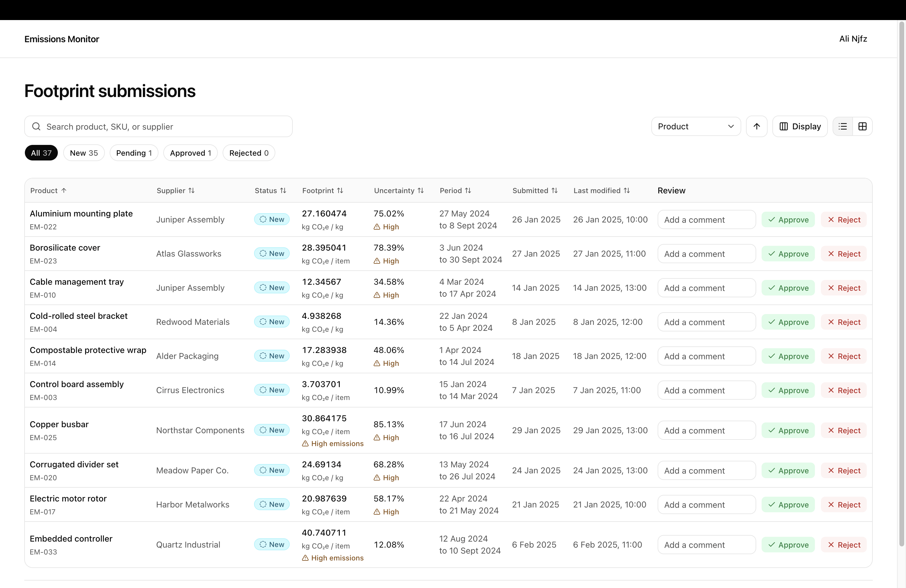
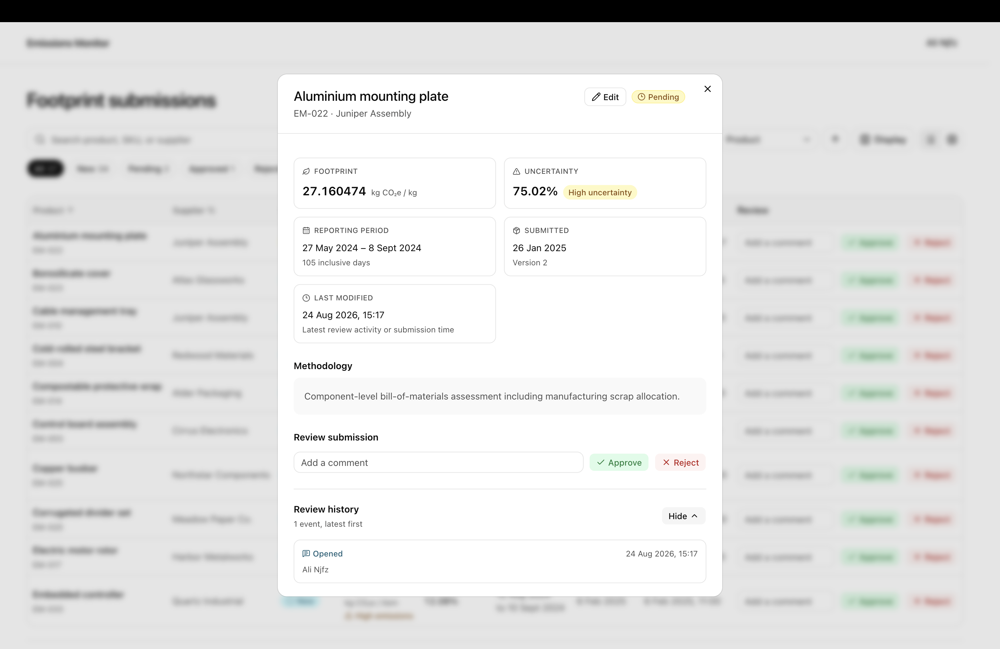
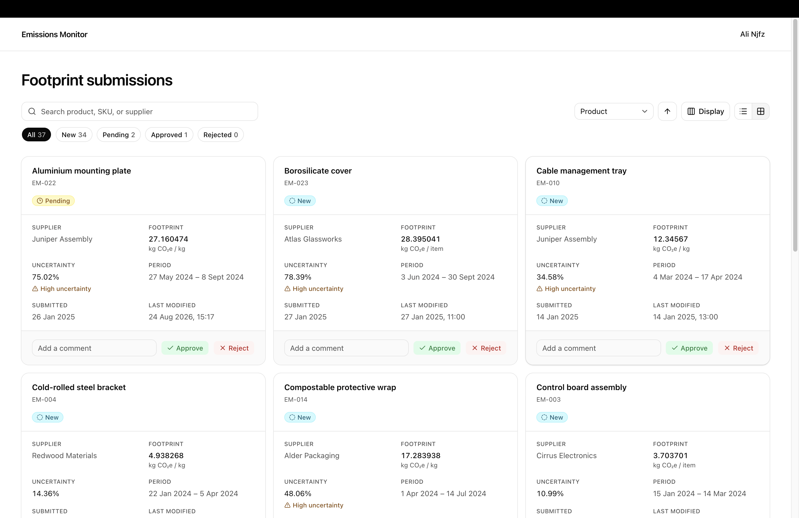
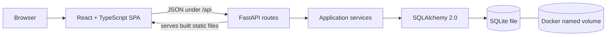
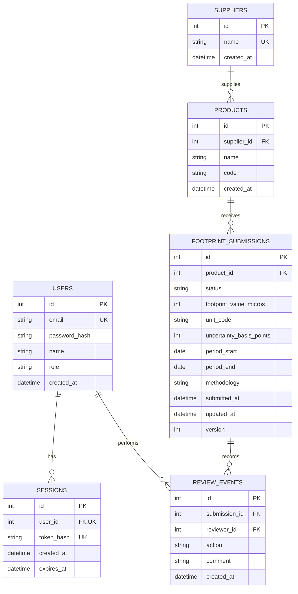

# Emissions Monitor

Emissions Monitor is a full-stack product-footprint review application. Reviewers can browse, create, edit, delete, search, filter, sort, inspect, approve, and reject fictional supplier submissions without losing their queue context.

The implementation intentionally favors explicit, understandable code that can be changed confidently during a follow-up pairing session.



## Table of contents

- [Quick start](#quick-start)
- [Key features](#key-features)
- [Screenshots](#screenshots)
- [Technology stack](#technology-stack)
- [System overview](#system-overview)
- [Database model](#database-model)
- [Docker workflows](#docker-workflows)
- [Local development without Docker](#local-development-without-docker)
- [Project structure](#project-structure)
- [API examples](#api-examples)
- [Verification](#verification)
- [Important engineering choices](#important-engineering-choices)
- [Trade-offs and known gaps](#trade-offs-and-known-gaps)
- [Before production](#before-production)
- [AI usage](#ai-usage)

## Quick start

Requirements: Docker Desktop or Docker Engine with Compose.

```bash
git clone https://github.com/alinjfz/emission-monitor-neutreeno.git
cd emission-monitor-neutreeno
docker compose up --build
```

Open [http://localhost:5173](http://localhost:5173), then sign in with the demo reviewer:

```text
Email: a@a.a
Password: 1234
```

The development stack seeds 36 deterministic submissions automatically. Frontend edits hot-update in the browser and backend edits restart FastAPI.

## Key features

- **Review queue:** browse submissions in responsive table or card views with pagination and configurable visible fields.
- **Fast discovery:** search across product, SKU, and supplier; filter by status; and sort by product, supplier, footprint, uncertainty, dates, or activity.
- **Complete review workflow:** inspect submission details, add an optional comment, approve or reject, and view immutable review history.
- **Submission management:** create, edit, and delete submissions while the application manages statuses, timestamps, and versions.
- **Resilient state:** preserve search, filters, sorting, pagination, view mode, and selected detail in the URL.
- **Concurrency safety:** reject stale reviews with the latest submission in an HTTP 409 response while retaining the reviewer's local draft.
- **Exact footprint data:** preserve six-decimal footprint values from SQLite through Python and JSON to TypeScript without floating-point conversion.
- **Accessible feedback:** provide keyboard-friendly controls, focus-managed dialogs, live notifications, and non-color risk indicators.

## Screenshots

### Submission detail and review history



### Card view



## Technology stack

| Area | Technology | Role |
| --- | --- | --- |
| Frontend | React, TypeScript, Vite | Feature-oriented single-page application |
| UI | Tailwind CSS, shadcn, Radix UI | Styling and accessible interface primitives |
| Backend | FastAPI, Pydantic | Synchronous HTTP API and request/response validation |
| Persistence | SQLAlchemy 2.0, SQLite | Parameterized queries, transactions, and local data storage |
| Migrations | Alembic | Versioned database schema changes |
| Authentication | Argon2id, HTTP-only cookies | Password hashing and hashed session-token authentication |
| Development | Docker Compose | Reproducible frontend, backend, and persistent-volume setup |
| Quality | pytest, Ruff, oxlint, TypeScript | Backend tests, linting, formatting, and frontend validation |

## System overview



- React owns presentation, URL state, local drafts, and frontend-calculated duration.
- FastAPI owns authentication, authorization, validation, status transitions, concurrency, and safe API errors.
- SQLAlchemy owns parameterized persistence and transaction boundaries.
- Alembic owns schema history.
- SQLite stores application data in a Docker named volume.
- In the production-style container, FastAPI serves both `/api/*` and the compiled React SPA from one origin.

The frontend is organized by feature. The backend separates HTTP routes, Pydantic API schemas, use-case services, and SQLAlchemy models. A generic repository layer, Redux, TanStack Query, and form libraries were deliberately omitted because they would add abstraction without helping this small vertical slice.

## Database model

Methodology is stored directly as text on each footprint submission rather than in a separate lookup table.



## Docker workflows

Normal container restarts preserve users, sessions, submissions, and review history in the `emissions_data` named volume.

Stop the application without deleting data:

```bash
docker compose down
```

Follow both development logs:

```bash
docker compose logs -f app frontend
```

The containers use polling so file changes are detected reliably through Docker Desktop on macOS. Dependency-file changes (`package-lock.json` or `requirements.txt`) require rebuilding with `--build`.

Reset all application data and return to the original 36 `new` fixtures:

```bash
docker compose down -v
docker compose up --build
```

> **Warning:** `docker compose down -v` deliberately deletes the local named volume and cannot preserve its review history.

### Production-style container

Build the single production-style container without the automatic development override:

```bash
docker compose -f compose.yaml up --build
```

Open [http://localhost:8000](http://localhost:8000).

## Local development without Docker

Use two terminals so Vite provides fast frontend refresh while proxying `/api` to FastAPI.

Backend:

```bash
python3 -m venv backend/.venv
source backend/.venv/bin/activate
python -m pip install -r backend/requirements.txt
cd backend
alembic upgrade head
python -m app.db.seed
fastapi dev app/main.py
```

Frontend:

```bash
cd frontend
npm install
npm run dev
```

Open [http://localhost:5173](http://localhost:5173). Local SQLite data lives under `backend/data/` and is ignored by Git.

## Project structure

```text
.
├── backend/
│   ├── app/
│   │   ├── api/routes/     # Thin FastAPI route handlers
│   │   ├── services/       # Use cases and transaction boundaries
│   │   ├── schemas/        # Pydantic API contracts
│   │   ├── models/         # SQLAlchemy persistence models
│   │   └── db/             # Session, seed data, and custom types
│   ├── alembic/            # Database migrations
│   └── tests/              # Backend integration and regression tests
├── frontend/src/
│   ├── features/           # Authentication and submission features
│   ├── components/ui/      # Shared shadcn UI primitives
│   ├── lib/                # API, date, format, unit, and risk helpers
│   └── types/api.ts        # Central API types
├── docs/images/            # README screenshots
├── compose.yaml            # Production-style service definition
└── compose.override.yaml   # Development services and live reload
```

## API examples

The examples below use the development frontend at `http://localhost:5173`. The Vite server proxies `/api` requests to FastAPI. Store the authentication cookie after logging in:

```bash
curl --silent --show-error \
  --cookie-jar /tmp/emissions-cookie.txt \
  --header 'Content-Type: application/json' \
  --data '{"email":"a@a.a","password":"1234"}' \
  http://localhost:5173/api/auth/login
```

List the first five new submissions:

```bash
curl --silent --show-error \
  --cookie /tmp/emissions-cookie.txt \
  'http://localhost:5173/api/submissions?status=new&sort=queue&page=1&page_size=5'
```

Retrieve a submission before reviewing it to obtain its current `version`:

```bash
curl --silent --show-error \
  --cookie /tmp/emissions-cookie.txt \
  http://localhost:5173/api/submissions/1
```

Approve that submission using the returned version as `expected_version`:

```bash
curl --silent --show-error \
  --request POST \
  --cookie /tmp/emissions-cookie.txt \
  --header 'Content-Type: application/json' \
  --header 'Origin: http://localhost:5173' \
  --data '{"action":"approved","comment":"Evidence checked.","expected_version":1}' \
  http://localhost:5173/api/submissions/1/reviews
```

Replace `expected_version` with the current value returned by the detail endpoint. A stale version receives HTTP 409 and the latest submission. Interactive API documentation is available from FastAPI at [http://localhost:8000/docs](http://localhost:8000/docs).

## Verification

Backend:

```bash
cd backend
python -m pytest
ruff check app alembic tests
ruff format --check app alembic tests
```

Frontend:

```bash
cd frontend
npm test
npm run lint
npm run build
```

## Important engineering choices

### Exact numbers

Footprint values are stored as millionths and uncertainty as basis points in SQLite integer columns. A `ScaledDecimal` SQLAlchemy type converts them to Python `Decimal`. The API emits decimal strings, and the frontend formats those strings without converting them to JavaScript `Number`.

### Safe queries

List queries use SQLAlchemy expressions and bound parameters. Sort keys are mapped through a fixed allowlist, pagination is bounded, and `%`, `_`, and `\` are escaped before literal search matching.

### Concurrent review

Review requests update only the expected version. A stale reviewer receives HTTP 409 plus the latest submission, while their unsaved comment remains local. Edits use last-write-wins behavior while still incrementing the system-managed version counter. Opening uses a conditional `new → pending` update and a unique partial index, so concurrent opens create one `opened` event.

### Review history

Review history is append-only. `last_modified_at` is derived from the newest review event, falling back to `submitted_at`; it is not stored as a separate database column. Opening a submission creates at most one `opened` event, enforced by both application logic and a SQLite unique partial index.

## Trade-offs and known gaps

- Authentication is intentionally local and assignment-grade: no email verification, password reset, rate limiting, OAuth, or account administration.
- SQLite is a strong fit for a single-container review exercise, but a horizontally scaled production service would use PostgreSQL and a centralized session store.
- The frontend refreshes the bounded list after writes instead of introducing a server-state cache.
- There is one high-value API integration flow rather than broad unit/component coverage.
- Supplier and product values are managed through submission forms; there is no separate catalog-administration surface.
- There is no public deployment, telemetry, audit export, or secure-sharing permission model.

## Before production

Use HTTPS-only cookies and secret management, add rate limiting and security monitoring, broaden tests, introduce production migrations and backups, add session-management and password-reset flows, and evaluate PostgreSQL if multiple service instances or sustained write concurrency are required.

## AI usage

AI assistance is disclosed separately in [AI_USAGE.md](AI_USAGE.md).
